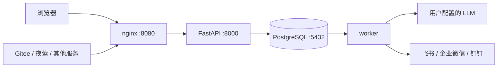

# Webhook Transfer Station · Webhook 中转站

一款强大的、智能的、可溯源的Webhook AI处理中转站

接收 Gitee 仓库事件、夜莺告警及其他服务回调，按规则使用 LLM 整理消息，转发至飞书、企业微信或钉钉。提供管理界面、消息日志、Skill 管理和自然语言操作助手。


## 0. 运行示例


## 1. 先选一条上手路线

| 你的目标 | 阅读顺序 | 启动成功的标志 |
| --- | --- | --- |
| 先体验完整产品 | 本文第 2–4 节 | 8080 页面能登录，能查看规则和日志 |
| 开发 Python 后端 | 本文 → [后端开发指南](backend/README.md) | 8000/docs 可用，worker 能连接数据库 |
| 开发 Vue 前端 | 本文 → [前端开发指南](frontend/README.md) | 5173 页面可登录，修改 Vue 文件自动更新 |
| 同时开发前后端 | 本文 → 后端指南 → 前端指南 | PostgreSQL + API + worker + Vite 同时运行 |

根目录是同时包含 `backend/`、`frontend/`、`docker-compose.yaml` 的文件夹。以下终端命令使用 macOS / Linux 的 bash 或 zsh；Windows 初学者请在 WSL2 中使用相同命令，并开启 Docker Desktop 的 WSL 集成。代码块中的说明文字和 `<占位符>` 不是实际配置，使用前需替换。

已经下载源码就直接用编辑器打开根目录；尚未下载时，在代码托管页面复制仓库的 Clone 地址，使用 `git clone <仓库地址>`，再进入下载的目录。

## 2. 项目由哪些服务组成

| 模块 | 作用 | 技术 |
| --- | --- | --- |
| frontend | 页面及生产环境 API 反向代理 | Vue3、TypeScript、Element Plus、Vite、nginx |
| backend | 登录、规则、日志、Skill、聊天和接收回调 | Python 3.12、FastAPI、SQLAlchemy Asyncio、asyncpg、JWT |
| worker | 从数据库领取消息，调用 LLM 并投递群消息 | 与 backend 共用 Python 代码和镜像 |
| postgres | 存储配置、消息队列、日志和聊天记录 | PostgreSQL 16 |
| migrate | 启动前建表/升级表结构、初始化管理员，成功后退出 | Alembic、bootstrap |



聊天由 API 进程执行工具调用，消息中转由 worker 执行；只启动 API 可以登录、管理规则和聊天，但入队的回调不会被投递。

## 3. 用 Docker 启动完整项目

这是体验和部署路线；修改源码后立即生效的开发路线见前后端指南。需要已启动的 Docker Desktop 或 Docker Engine + Compose 插件，以及运行初始化脚本的 Python 3。

### 3.1 检查环境

在根目录执行：

```bash
python3 --version
docker --version
docker compose version
docker info
```

`docker info` 应能返回服务端信息；若提示无法连接 daemon，先启动 Docker。本文使用 `docker compose` 命令，项目文件采用 Compose Specification，不需要旧的 `version: "3.5"`。`x-backend`、`&backend`、`<<: *backend` 是公共配置与 YAML 锚点，供 API、worker、migrate 复用。

### 3.2 初始化配置

仅首次运行，根目录执行：

```bash
python3 scripts/init_env.py
```

脚本从 `.env.example` 生成 `.env`，随机创建数据库密码、JWT 签名密钥和 Fernet 加密密钥。已有 `.env` 时会拒绝覆盖，此时保留原文件即可，不要为了重跑脚本删除原密钥。

用编辑器查看 `.env`，本地体验保持默认端口和地址即可。更换模型供应商时修改 `LLM_ALLOWED_HOSTS`；真实的模型 API Key 和模型名称稍后在网页「个人设置」填写。

### 3.3 构建并启动

仍在根目录：

```bash
docker compose up -d --build
docker compose ps -a
```

第一次需要下载镜像和依赖，等待时间较长。`postgres`、`backend`、`worker`、`frontend` 应处于运行状态；`migrate` 正常结果是 `Exited (0)`，它是一次性初始化任务。

```bash
curl -i http://localhost:8080/health/ready
```

预期 HTTP 200，响应包含后端与 PostgreSQL 的 `ok` 状态。然后打开：

- 管理界面：<http://localhost:8080>
- API 文档：<http://localhost:8080/docs>
- 默认账号：`admin` / `Admin#123.`；若初始化前修改了 ADMIN 配置，则使用对应账号。

### 3.4 第一次登录后做什么

1. 修改默认密码，重新登录。
2. 查看「中转规则」「消息日志」「Skill 管理」「个人设置」。无需模型凭证也可以使用基础管理功能。
3. 需要 AI 时，在「个人设置」填写含 API 前缀的 LLM Host（如 `https://api.openai.com/v1`）、模型名和 API Key。Host 不包含 `/chat/completions`；域名需在允许列表中。
4. 点击「检测已保存配置」会真实调用一次模型。聊天还要求模型支持 `tools/tool_calls`。
5. 新增规则后配置源站回调。可以关闭规则的 LLM 开关，此时使用模板直接转发；仍需要有效群机器人地址才能投递。

## 从 Gitee 到群消息

1. 在飞书 / 企业微信 / 钉钉群创建自定义机器人，复制完整 Webhook URL。若开启飞书/钉钉签名验证，另保存签名密钥。平台关键词、IP 白名单等策略仍由管理员在平台侧配置。
2. 登录系统，在「个人设置」保存 LLM Host、API Key、模型 ID。Host 含 API 前缀，例如 `https://api.openai.com/v1`，不包含 `/chat/completions`。如使用其他服务商，先将域名加到 `LLM_ALLOWED_HOSTS` 并重建 API 与 worker 容器配置。
3. 点击「检测已保存配置」验证模型。检测会真实发起一次小型模型调用。
4. 在「中转规则」新增规则，填写 Gitee 仓库页面地址、事件、源站鉴权开关（开启时设置至少 8 位回调密钥）、提示词、目标机器人地址与消息模板。
5. 保存并复制生成的 `/webhooks?wid=...` URL。wid 的值不需要加引号。
6. 在 Gitee 仓库「管理 → WebHooks」配置此 URL，选择 JSON 格式及相应事件；中转规则开启源站鉴权时，将相同的回调密钥作为密码。
7. 触发事件，在「消息日志」查看 pending → processing → succeeded，并检查目标群消息。

不使用模型时关闭规则的 LLM 开关：源站模板结果将直接作为 `llm_output`，仍经过目标模板和平台包装。

协议、模板变量、@人员、夜莺/通用回调示例集中在 [后端指南：回调接入与消息规则](backend/README.md#回调接入与消息规则)。本机地址不能供外部 Gitee 直接回调；实际接入需要源站可访问的地址。

## 4. 配置、端口与请求路径

### 两份 .env 的用途

| 文件 | 谁读取 | 用途 |
| --- | --- | --- |
| 根目录 `.env` | Docker Compose | 替换 Compose 变量；Compose 再把指定变量传入容器 |
| `backend/.env` | 在 backend 目录运行的 Python 进程 | 本地 API、worker、Alembic、初始化脚本的配置 |

两份文件不会自动同步。Compose 在容器内使用 `postgres:5432`；本地 Python 使用 `127.0.0.1:宿主机端口`。前端不读取这两份文件，也不应保存数据库密码或模型 API Key 到前端构建变量中。

| 根目录变量 | 默认 / 要求 | 说明 |
| --- | --- | --- |
| POSTGRES_DB / POSTGRES_USER | webhooks | 数据库名/用户 |
| POSTGRES_PASSWORD | 脚本生成 | Compose DSN 中应使用 URL 安全字符，推荐保留生成值 |
| POSTGRES_PORT | 5432 | 当前 Compose 的 PostgreSQL 宿主机端口；可自行添加到 `.env` |
| JWT_SECRET | 至少 32 字符 | 签发登录令牌 |
| ENCRYPTION_KEY | 有效 Fernet Key | 加密凭证、消息快照和聊天消息，必须保留 |
| ADMIN_USERNAME / ADMIN_PASSWORD | admin / Admin#123. | 首次创建账号；修改变量不会重置已有密码 |
| HTTP_PORT | 8080 | nginx 对外端口 |
| PUBLIC_BASE_URL | http://localhost:8080 | 生成的回调 URL 基础地址；改端口时一起修改 |
| LLM_ALLOWED_HOSTS | api.openai.com | 精确域名匹配，多个域名用逗号分隔 |
| ALLOW_HTTP_LLM | false | 仅可信内网 HTTP 模型需要开启 |

当前 `docker-compose.yaml` **已配置 PostgreSQL 端口映射** `${POSTGRES_PORT:-5432}:5432`。这与早期“数据库不发布端口”的说明不同，以当前文件为准。正式部署若不需要外部数据库访问，可删除该映射；仅供本机调试时可改为 `127.0.0.1:${POSTGRES_PORT:-5432}:5432`。

| 场景 | 页面入口 | API 请求流向 |
| --- | --- | --- |
| 完整 Compose | localhost:8080 | 浏览器 `/api/...` → nginx → `backend:8000` |
| 本地开发 | localhost:5173 | 浏览器 `/api/...` → Vite 代理 → `127.0.0.1:8000` |

backend 不映射宿主机 8000 也能被 nginx 访问：它们在同一 Compose 网络，通过服务名通信。`ports` 用于宿主机访问容器；`EXPOSE` 不是宿主机端口映射。细节见 [前端请求说明](frontend/README.md#页面如何调用后端)。

## 5. Skill 与聊天助手

平台内置 11 个 Skill 和 20 个业务工具，支持自定义 Skill 的新增、编辑、启停、删除与导出。内置项可以编辑、停用和恢复默认。Skill 是说明文本加工具白名单，不执行上传脚本。

登录后点击右下角「智能助手」，可选择 Skill、查看历史并用自然语言控制平台，例如“查询最近失败消息”“创建夜莺到飞书的规则”“修改我的姓名”。查询直接执行；创建、修改、删除、重试先展示操作卡，点击确认才执行。

密码、API Key、群机器人 URL 等通过操作卡的独立表单填写，不进入模型上下文；不要粘贴到聊天正文。聊天正文、所选 Skill 说明和工具查询结果会发送到用户配置的模型。每轮限 55 秒/8 次工具调用，草案有效期 15 分钟。

站内使用 REST + 服务端受控工具层，无需额外 MCP Server。未来外部 AI 客户端接入时可增设 MCP 适配与外部鉴权。完整设计见 [m04](docs/m04_Skill与智能助手设计文档.md)。

## 6. 日常运维与升级

以下均在根目录运行：

```bash
# 查看状态及日志；Ctrl+C 只退出日志跟随
docker compose ps -a
docker compose logs --tail=100 postgres migrate backend worker frontend
# 重启现有 worker
docker compose restart worker
# 停止项目，保留数据库卷
docker compose down
```

需要多 worker 时可在根目录运行 `docker compose up -d --scale worker=2`，并按模型与群机器人的限流调整数量。

修改 `.env` 后用 `docker compose up -d` 重建需要更新的容器，单纯 `restart` 不会重新注入环境变量。变更源码后需要重新构建镜像。

升级已有部署时，先备份数据库和原 ENCRYPTION_KEY，再停止应用进程并显式运行迁移：

```bash
docker compose stop frontend backend worker
docker compose build
docker compose run --rm migrate
docker compose up -d
```

仅在迁移命令成功后执行最后一步。当前迁移 head 为 `0004`；`0002` 增加多源和 @ 配置，`0003` 增加 Skill 与聊天表，`0004` 增加源站回调鉴权开关。降级可能丢数据，不能把迁移回退当作无损撤销。

备份数据库（根目录）：

```bash
docker compose exec -T postgres sh -c 'pg_dump -U "$POSTGRES_USER" -d "$POSTGRES_DB" -Fc' > station.dump
```

恢复需使用 `pg_restore` 导入新的目标数据库，同时保留原 ENCRYPTION_KEY，并在恢复期间停止 API/worker。`docker compose down -v` 会删除数据库卷，普通停机不要加 `-v`。改变数据库初始化密码变量不会修改已有数据卷中的数据库密码。

健康接口：`/health/live` 检查 API 存活；`/health/ready` 检查数据库；登录后的 `POST /api/health/llm` 检查当前用户模型并产生一次模型调用。LLM 故障不影响 readiness，以便登录排查。

## 7. 常见启动问题

| 现象 | 先检查什么 |
| --- | --- |
| 无法连接 Docker daemon | Docker Desktop/Engine 是否启动，`docker info` 是否成功 |
| 镜像下载超时 | Docker 镜像仓库和网络；不能把下载失败当作应用代码报错 |
| 5432 / 8080 已被占用 | 调整 POSTGRES_PORT / HTTP_PORT，并同步本地 DATABASE_URL / PUBLIC_BASE_URL |
| migrate 非 0 退出 | `docker compose logs migrate postgres`，核对数据库用户、密码、连接及迁移错误 |
| 网页 502 或无法登录 | backend 是否健康；完整部署浏览器访问 8080，不是 8000 |
| 消息一直 pending | worker 是否运行、连接了相同数据库；查看 worker 日志 |
| 本地 worker ConnectionRefusedError | [后端数据库排错](backend/README.md#常见错误与排查顺序) |
| 5173 能打开但 API 失败 | [前端代理排错](frontend/README.md#常见错误与排查顺序) |

## 8. 目录、检查与进一步阅读

```text
README.md                  项目总览、完整部署与运维
backend/README.md          Python 后端开发、回调协议、测试与排错
frontend/README.md         Vue 前端开发、请求代理、构建与排错
backend/app/               API、worker、模型、Skill 和聊天工具
backend/alembic/           数据库迁移
backend/tests/             自动化测试
frontend/src/              页面、路由、API 客户端、聊天组件
frontend/nginx.conf        部署环境静态页面与反向代理
scripts/init_env.py        创建根目录 .env
.github/workflows/ci.yml   CI 检查
```

后端检查使用 Ruff、pytest；前端使用 ESLint、vue-tsc、Vite 构建。具体命令在各自指南，CI 另验证 PostgreSQL、迁移和容器构建。

- [需求设计](docs/m01_需求详细设计文档.md)
- [技术架构](docs/m02_技术架构详细设计文档.md)
- [后端设计](docs/m03_后端开发设计文档.md)
- [Skill 与助手设计](docs/m04_Skill与智能助手设计文档.md)
- [验收记录与外部联调限制](docs/验收记录.md)

支持 JSON/文本/表单的 HTTP POST 回调、平台原生通知卡片和 Chat Completions 兼容调用；不包含公开注册、附件或模型自动降级。真实模型、仓库和群机器人联调需要自己的凭证。业务日志可能包含仓库内容与个人信息，本版没有自动过期清理，需自行制定备份和保留策略。

## 源站回调鉴权开关

新增/编辑规则可设置「源站回调鉴权」，默认开启。关闭后请求 `/webhooks?wid=...` 无需额外回调密钥；持有 URL 的人均可触发该规则，wid 用于定位规则，不证明请求来源。规则启停、消息格式/大小、事件过滤和 Gitee 仓库匹配仍有效。目标机器人签名与管理员登录鉴权不受影响。关闭时保留已有源站密钥；重新开启时必须已有密钥或填写至少 8 位新密钥。已有部署执行 `alembic upgrade head` 到 0004，旧规则保持鉴权开启。
