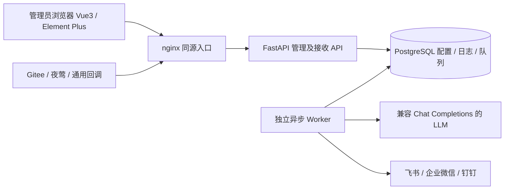
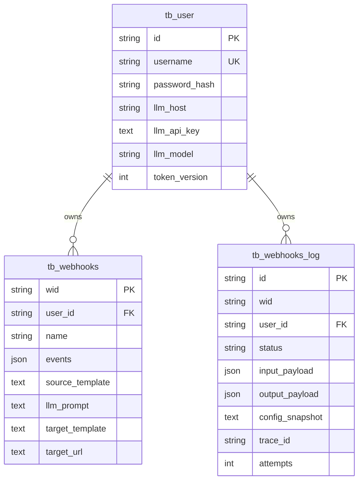
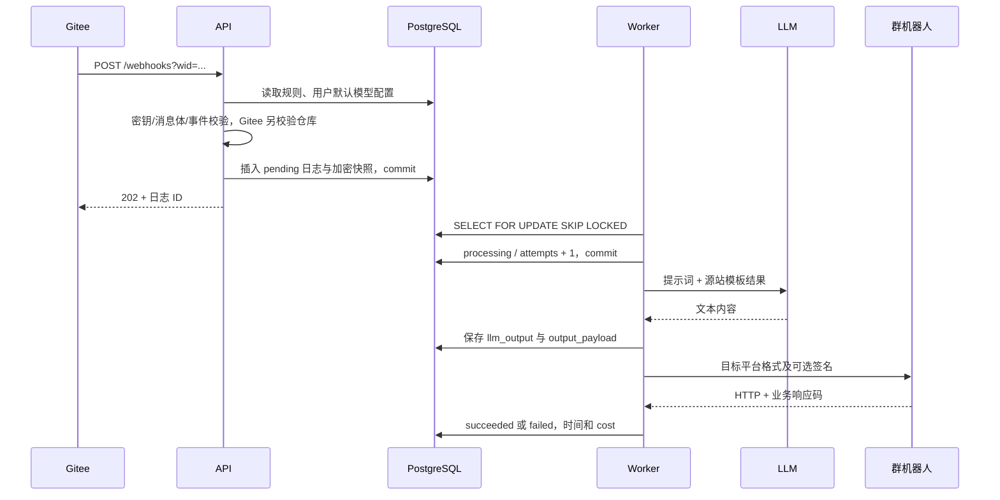

# Webhook 中转站技术架构详细设计

版本：1.1。角色：系统架构设计师。依据：[需求详细设计](m01_需求详细设计文档.md)。

## 1. 总体架构

前端与 API 通过 nginx 同源暴露，减少跨域配置和额外 Cookie 行为。数据库不发布宿主机端口，API 和 worker 使用容器内部网络。`migrate` 服务完成 Alembic 升级及管理员初始化，API/worker 在其成功后启动。前端等待 API readiness。

第一版使用 PostgreSQL 队列表，无 Redis/Celery 依赖。单个 worker 顺序处理，多 worker 通过行锁并发领取任务。部署目标为小到中等规模的仓库消息中转；吞吐取决于模型时延和 worker 数量。

## 2. 服务职责

| 模块 | 职责 |
| --- | --- |
| frontend/src/views | 登录、规则列表及编辑抽屉、日志筛选及详情、用户和 LLM 设置 |
| app/api.py | REST 路由、所有权检查、回调接收、状态查询 |
| app/models.py / db.py | SQLAlchemy 2 Async ORM、asyncpg、事务与连接池 |
| app/security.py / deps.py | 密码哈希、JWT、敏感信息加密、登录身份 |
| app/sources.py | 源站载荷解析、鉴权和非 Gitee 事件归一化 |
| app/templates.py | 白名单模板变量及安全 JSON 路径的一次替换 |
| app/outbound.py | LLM 请求、平台 payload、签名、业务成功码检查 |
| app/worker.py | 数据库队列消费、处理结果落库、中断恢复 |
| app/trace.py | Trace Header 透传与请求结束耗时日志 |
| alembic | 版本化结构迁移 |

## 3. 数据模型

所有主键使用 32 字符 UUID4 hex；应用生成。时间使用 timezone-aware UTC，在 PostgreSQL 落为 timestamptz。结构化输入/输出使用 SQLAlchemy JSON（在 PostgreSQL 为 JSON）；本版没有复杂 JSON 检索，不为其建立全文或 GIN 索引。

### 3.1 tb_user

`id, username, password_hash, real_name, phone, llm_host, llm_api_key, llm_model, token_version, created_at, last_login_at`。用户名唯一；Key 加密。Token 包含版本，修改密码/退出登录递增版本，旧 Token 失效。

### 3.2 tb_webhooks

`wid, user_id, name, source_type, source_auth, source_token_header, source_url, source_info, source_secret, events, source_template, llm_enabled, llm_prompt, target_type, target_mentions, target_template, target_url, target_secret, enabled, created_at, updated_at`。

URL 由 `PUBLIC_BASE_URL + /webhooks?wid=...` 计算，不将部署域名重复存储于数据库。更换域名只需修改部署配置，但管理员仍需同步更新 Gitee 配置。

### 3.3 tb_webhooks_log

`id, wid, user_id, webhook_name, trace_id, delivery_id, event, input_payload, output_payload, llm_output, config_snapshot, status, attempts, error, target_response, received_at, started_at, output_at, finished_at, cost_ms`。

`wid` 不建规则外键，保留被删规则历史与待处理任务；用户外键保留所有权。`config_snapshot` 加密冻结当时的规则与 LLM 配置，worker 不依赖规则仍然存在。

索引：规则 `user_id`；日志 `wid`、`trace_id`、`(status, received_at)`、`(user_id, received_at)`；唯一 `(wid, delivery_id)`。delivery_id 可空，空值不去重。

## 4. 核心时序与事务

不在数据库长事务中执行网络调用。领取任务的短事务持锁至 status 更新提交；发送前持久化已经生成的输出。只有 HTTP 与平台业务码都成功才记录 `output_at`。

同一个业务外发和数据库提交不能组成分布式原子事务。如果群机器人已接收但成功状态提交前 worker 崩溃，则只能判定为结果未知，不能保证恰好一次投递。

## 5. 可靠性策略

- worker 全流程 150 秒截止；单次 HTTP 默认 45 秒，可配置上限 60 秒。
- 处理租约默认 300 秒，最小 180 秒，严格大于 worker 截止。
- 每轮扫描过期 processing，将其标记 failed，不自动重发未知结果。
- 队列处理异常不会退出循环；数据库故障 5 秒后再次检查。
- 手动重试通过 `UPDATE ... WHERE status='failed' AND user_id=...` 原子转换，避免并发点击重复入队。
- 重试使用接收快照；修改用户 Key 不会更改历史队列里的 Key。旧 Key 撤销后，旧消息重试可能仍失败，应重新触发源站事件。
- worker 优雅停止时间设置为 160 秒；强制停止后仍依靠租约回收。
- 日志不默认删除，长期部署应由运维制定清理与归档策略，不清理 pending/processing。

## 6. 安全与网络

密码使用 PBKDF2-SHA256 而不是单轮 SHA256：随机盐 + 600000 次迭代，哈希结果含算法及参数。默认密码仅用于首次初始化；部署后修改环境变量不重置现有账户密码。

JWT 采用 HS256，校验 issuer、exp、iat、sub、ver，过期默认 120 分钟，无 refresh token。前端使用 sessionStorage 保存凭证，关闭标签页后清理；不提供 HTML 内容渲染，展示模型和日志时使用 Vue 文本插值。

Fernet 主密钥和 JWT 密钥由环境提供，无可上线的内置固定密钥。API 不回传密码、API Key、回调密钥或目标 URL。请求参数校验失败也不包含 Pydantic 原始 input，避免密码被回显。

目标只允许对应平台官方 HTTPS 主机及机器人路径，端口只允许默认/443。LLM Host 仅允许运维设置的精确域名，不接受用户信息、查询参数或 fragment；默认只允许 HTTPS。内网模型必须由运维显式加入主机允许列表，并按需要启用 HTTP。禁止自动重定向，避免目标跳转至内网。允许列表是一项信任配置，不能加入不受信任的自定义域名；更严格的生产环境还应配置出口防火墙。

Gitee 源站优先校验 X-Gitee-Token，兼容 JSON password。比较使用 constant-time 比较。JSON 凭证字段递归脱敏，再存储与发送 LLM；不保存全部原始 Headers。

## 7. 可观测性与健康检测

HTTP Trace ID 接受 `[a-zA-Z0-9._-]{1,64}`，不合法/缺失时生成。所有 API 响应含 X-Trace-Id，日志含 method、path（无查询串）、status、cost_ms；worker 记录 trace_id、log_id、status、cost_ms。

`/health/live` 表示 API 进程响应；`/health/ready` 在 5 秒内执行 SELECT 1；`POST /api/health/llm` 使用当前用户配置发起小型模型请求。模型健康与 API readiness 分离，避免 LLM 故障导致管理界面无法访问。检测 LLM 要求登录，且可能付费。

nginx 限制登录速率与请求体。nginx 不记录 query string。Uvicorn 禁用默认访问日志；httpx 日志级别为 WARNING，防止带 token 的目标 URL 出现在普通日志中。

## 8. 交付、扩展与测试

前端构建阶段 Node 22，运行阶段非 root nginx；后端 Python 3.12 非 root；PostgreSQL 16 使用持久卷。提交 npm lockfile 和后端精确版本锁，支持可重复安装。

SQLite 只用于轻量 pytest，不是部署选项；必须在 PostgreSQL 集成测试中验证 SKIP LOCKED、迁移及空值唯一约束。CI 使用 PostgreSQL 服务执行全套测试，前端执行 lint、类型检查、生产打包。

新增源站时扩展事件归一化与鉴权适配；新增目标时扩展目标白名单、payload 构建、签名和业务响应校验。吞吐提升可扩容 worker，实际限制仍受模型/机器人平台配额约束。

## 9. 多源与人员配置实现

迁移 `0002_sources_mentions` 给 tb_webhooks 增加 source_auth（默认 header）、source_token_header（默认 X-Webhook-Token）与 target_mentions（JSON 默认 {}）。不改原 wid、不重写原 Gitee 数据。input_payload 保持同一个 JSON 数据库列，现在允许 JSON 数组/标量与文本。输出模型使用 JsonValue。

规则的 target_mentions 与 source_type、source_info 一起进入加密消息快照；worker 使用快照中的人员配置。在模型处理、目标文本渲染完成后，先由平台适配器添加 @ 元素，再执行长度校验、保存输出、添加签名、发送。旧快照缺少字段时默认为 Gitee、空元数据和无 @。

源站适配从 API 提取为 app/sources.py；JSON 解析拒绝非有限数字及 null，通用源站依据 Content-Type 可解析文本/表单。默认密钥 Header 可配置，不把任意回调数据变成出站 URL 或人员名单。通用/夜莺去重使用 X-Webhook-Delivery，不直接使用告警业务 id。

@ 配置仅接受结构化白名单字段，阻止飞书 ID 中注入标签。来自源站或 LLM 的飞书 at 标签转为普通文本，规则决定实际提醒对象。Gitee 鉴权仍为 X-Gitee-Token/JSON password，其他源站仅使用选中的 Header/Bearer/query 模式，URL token 不进入日志查询串或响应。

## 扩展架构：站内工具调用

聊天组件通过 JWT REST 接口访问后端。后端加载当前用户启用的 Skill，将注册工具的 JSON Schema 提供给用户配置的 LLM，再按用户身份执行查询或生成待确认写操作。工具层复用业务接口函数；确认执行使用行锁、对象指纹和单事务审计。新增 Skill、Conversation、ChatMessage、ChatAction 四表，迁移版本 0003。无需新增 MCP 服务，理由及未来适配边界见 [m04](m04_Skill与智能助手设计文档.md)。
